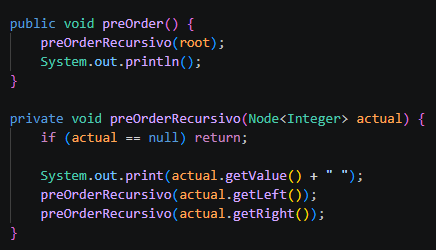
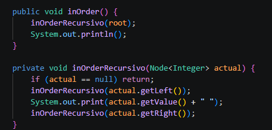
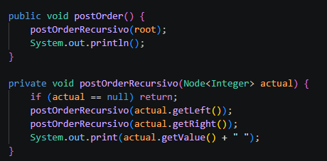
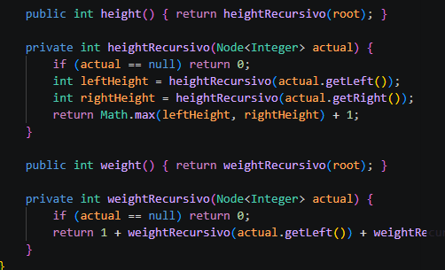
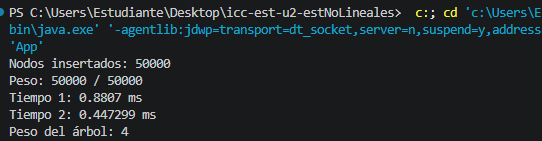

# Práctica: Estructuras no Lineales

## Datos del Estudiante
- **Nombre:** Eythan Solano
- **Curso:** G3

---
## icc-est-u2-estNoLineales
**Fecha:** 17/06/2026

**Descripción:** Se desarrolló un Árbol Binario de Búsqueda (BST) en Java, implementando una versión para enteros (intTree) y otra genérica (BinaryTree<T>) para ordenar objetos complejos (como Person). La estructura incluye los métodos recursivos de altura y los recorridos Pre-Order, In-Order y Post-Order. Finalmente, se optimizó el cálculo del peso de $O(n)$ a $O(1)$ usando un contador interno, mejora que fue validada con éxito en una prueba de rendimiento con 60,000 nodos.

## Métodos preOrder(), inOrder(), height()
**Fecha:** 17/06/2026

Método preOrder():
Recorre el árbol en orden: raíz → izquierda → derecha.
Imprime los valores en ese orden.

Método inOrder():
Recorre el árbol en orden: izquierda → raíz → derecha.
Útil para obtener valores ordenados.

Método postOrder():
Recorre el árbol en orden: izquierda → derecha → raíz.
Imprime los valores en ese orden.

## Calcular peso
**Fecha:** 17/06/2026

**Descripción:** Se crearon métodos para calcular la cantidad total de nodos de un árbol y su altura

# Resolución del informe
**Fecha:** 22/06/2026

**Descripcion:** Se realizaron los dos ejercicios propuestos para el desarrollo del informe

# Metodos HashCode, 
**Fecha:** 24/06/2026

**Descripcion:** Se implementaron metodos que convierten un objeto o conjunto de datos en un valor numérico único, optimizando la búsqueda, comparación y almacenamiento de información en estructuras de datos complejas.