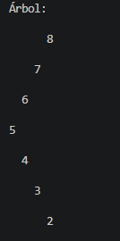
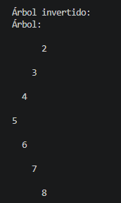

# Informe Ejercicios Arboles

# Ejercicio 1

    public BinaryTree<Integer> insert(int[] numeros) {

        BinaryTree<Integer> tree = new BinaryTree<>();

        int medio = numeros.length / 2;
        tree.insert(numeros[medio]);

        for (int i = 1; i <= medio; i++) {

            int izq = medio - i;
            if (izq >= 0) {
                tree.insert(numeros[izq]);
            }

            int der = medio + i;
            if (der < numeros.length) {
                tree.insert(numeros[der]);
            }
        }

        return tree;
    }

El método insert() crea un árbol binario insertando primero el elemento del medio del arreglo, después
inserta alternando izquierda y derecha desde el centro hacia afuera.

    public void printTree(Node<Integer> root) {
        System.out.println("Árbol:");
        printTreeRec(root, 0);
        System.out.println();
    }

El método printTree() imprime el árbol en consola en formato jerárquico y llama al método recursivo para mostrar la estructura visual del árbol.

    private void printTreeRec(Node<Integer> node, int space) {
        if (node == null) return;
            space += 2;

        printTreeRec(node.getRight(), space);
    
        System.out.println();
        for (int i = 2; i < space; i++) {
            System.out.print(" ");
        }

        System.out.println(node.getValue());

        printTreeRec(node.getLeft(), space);
    }

El método printTreeRec() recorre el árbol, usando espacios para representar la forma del árbol en consola.

# Ejercicio 2

    public void invert(Node<Integer> root) {
        invertRec(root);
    }

El método invert() inicia la inversión del árbol, llama al método recursivo que intercambia los nodos izquierda y derecha.

    private void invertRec(Node<Integer> node) {
        if (node == null) return;

        Node<Integer> temp = node.getLeft();
        node.setLeft(node.getRight());
        node.setRight(temp);

        invertRec(node.getLeft());
        invertRec(node.getRight());
    }

El método invertRec recorre el árbol de forma recursiva, en cada nodo intercambia su hijo izquierdo con el derecho.

